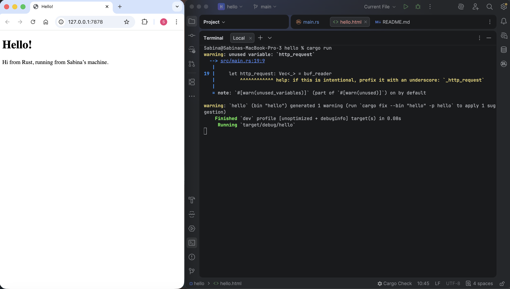
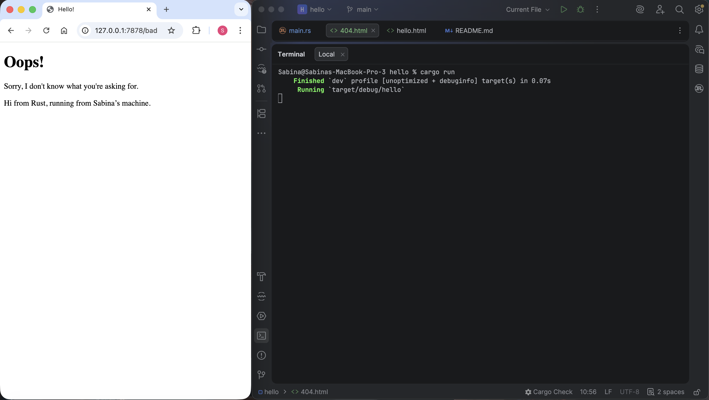

# Reflection

### Commit 1 Reflection Notes
#### Inside handle_connection method

Fungsi `handle_connection` menerima parameter `TcpStream` yang merepresentasikan 
koneksi antara server dan client. Di dalam fungsi tersebut, `BufReader` berfungsi untuk membaca data
HTTP request dari stream secara efisien. HTTP request yang dikirim oleh browser terdiri dari 
beberapa baris seperti request line (misalnya "GET / HTTP/1.1") dan header seperti Host, 
User-Agent, dan lainnya.

Metode `.lines()` digunakan untuk membaca setiap baris dari request, lalu `
.map(|result| result.unwrap())` digunakan untuk mengambil nilai string dari hasil pembacaan. 
Setelah itu, `.take_while(|line| !line.is_empty())` berfungsi untuk menghentikan pembacaan 
ketika mencapai baris kosong, yang berarti akhir dari header HTTP sudah dicapai.

Hasil dari pembacaan tersebut disimpan dalam sebuah vector bernama `http_request`, yang 
kemudian ditampilkan ke console menggunakan `println!`. Dari output yang di dapat, 
terlihat bahwa browser mengirim berbagai informasi tambahan seperti jenis browser, encoding, 
dan preferensi bahasa.

### Commit 2 Reflection Notes
#### Inside handle_connection method after modification

Pada milestone ini, saya mempelajari bagaimana server dapat memberikan response berupa halaman HTML
kepada browser. Pada fungsi `handle_connection`, server tidak hanya membaca request, tetapi juga
mulai membangun response HTTP yang lengkap.

`fs::read_to_string` berfungsi untuk membaca isi file HTML (hello.html), lalu panjang konten akan
dihitung untuk digunakan dalam header `Content-Length`. Header ini diperlukan untuk memberi tahu
browser seberapa besar data yang akan diterima, sehingga halaman dapat dirender dengan benar.

Response HTTP dibuat dengan mengikuti struktur tertentu, dimulai dengan status line
(misalnya "HTTP/1.1 200 OK"), kemudian header, lalu baris kosong, dan terakhir isi body (HTML).
Semua bagian tersebut digabungkan menggunakan `format!` sebelum dikirim melalui `stream.write_all`.

### Commit 3 Reflection Notes
#### How to split between responses and why the refactoring is needed

Ketika bagian error reponse pertama ditambahkan, kode langsung menggunakan `if-else` untuk splitting
proses pembuatan response, sehingga terdapat duplikasi kode pada 
bagian pembacaan file, perhitungan panjang konten, dan pengiriman response.

Karena code duplication merupakan code smell, perlu dilakukan refactoring dengan cara memisah
bagian yang berbeda dan bagian yang sama. Bagian yang berbeda hanya `status_line` dan 
`filename`, yang 
ditentukan berdasarkan request, seperti "GET / HTTP/1.1". Lalu, bagian yang
sama, seperti membaca file, menghitung panjang konten, membuat response string, dan pengiriman 
ke stream hanya perlu ditulis satu kali saja di luar kondisi `if-else`. Pada kode yang telah di 
refactor, tuple `(status_line, filename)` digunakan untuk menyimpan hasil dari percabangan kondisi.

Refactoring ini diperlukan karena meningkatkan readability dan maintainability kode. Sehingga jika 
nantinya ingin menambahkan lebih banyak route atau jenis response, hanya perlu menambahkan
kondisi baru tanpa menyalin ulang seluruh proses pembuatan response. Selain itu, kode menjadi 
lebih clean dan lebih mudah dipahami.

